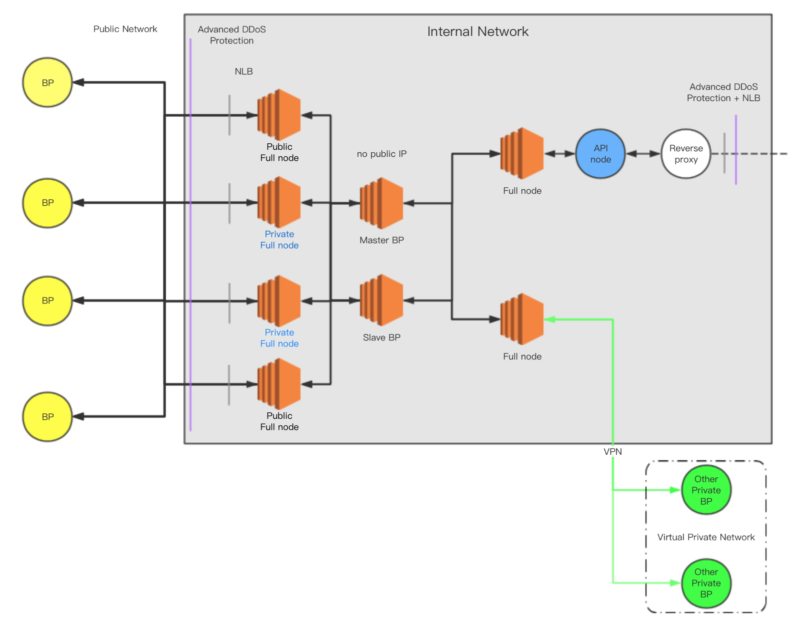
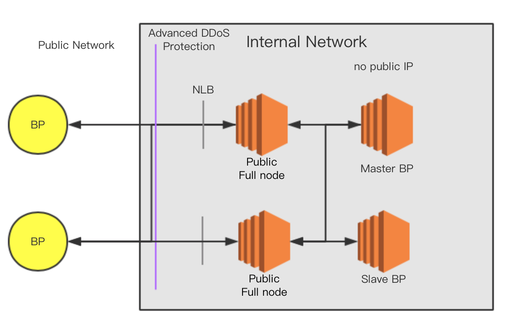
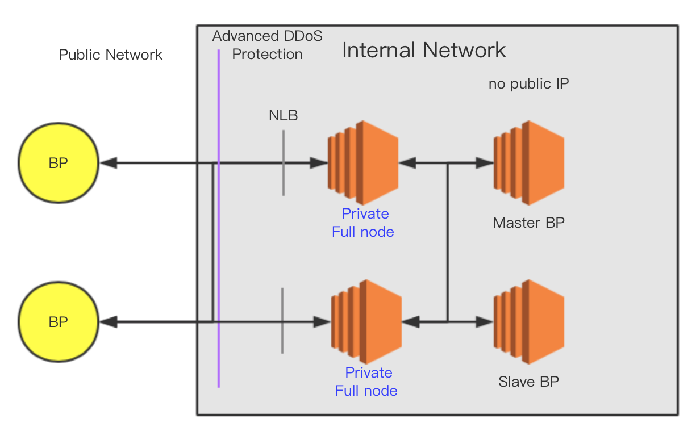
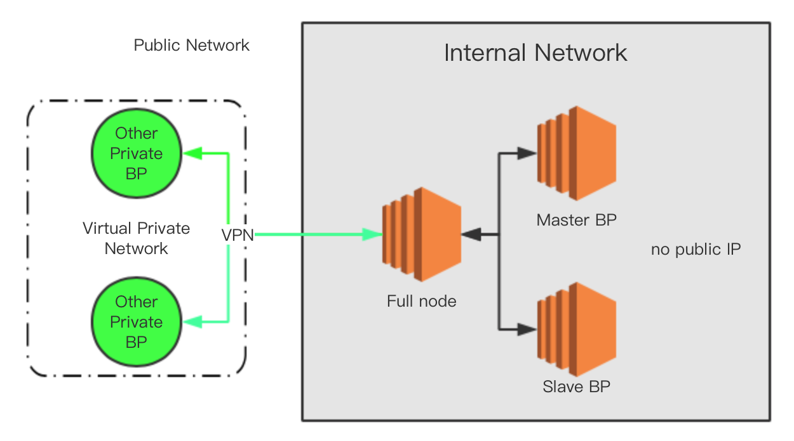
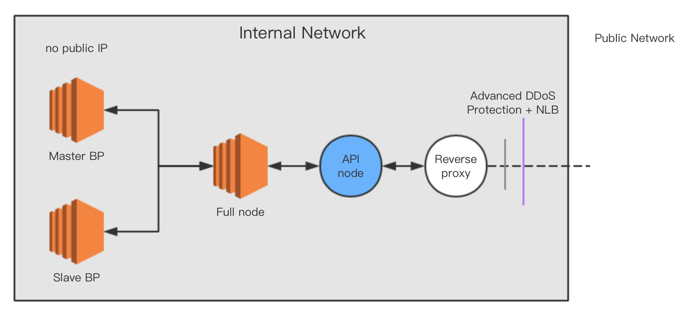
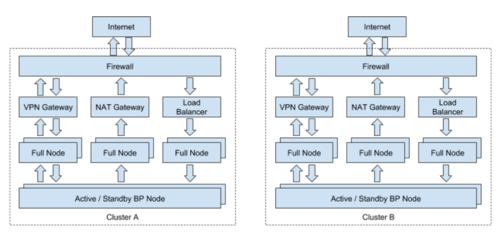

# EOS BP Nodes Security Checklist

> By SlowMist Security Team & Joinsec Team
> 
> Thanks IMEOS.ONE, EOS Asia, EOS Store for help

#### [中文版](./README.md)

## Architecture Core Goals

1. Protect the normal communication and operation of BPs
1. Enhance the overall anti-attack capability of the main network
1. Protect node security

## Challenges

1. DDoS during the boot phase of main network launch
1. RPC abuse
1. Communication failure

## Architecture Core Design

1. BP server isolation
1. Multiple jumping nodes
1. Multi-link high availability

## Core Defense

1. RPC should be turned off by default. If it needs to be turned on, security measures such as port obfuscation, advanced DDoS protection must be employed. 
1. BP Communication Multilink Design
	- The BP server should not be exposed on the public network. It communicates via jump servers，so there should be a large number of jump servers.
	- When there is a major failure of jump server/relay network, BP servers synchronize through a private network (1. Private Secret Node 2. Private VPN Link).
1. Protect BP Servers from being discovered and located in global scale network scans. Use most common ports such as 80, 443 or 22 as P2P/RPC ports instead of 9876/8888, which can effectively increase the attacker's cost to identify BPs. **Note: **setting the ports to totally random ports might also help.

## Recommended Overall Architecture



Architecture Overview:

In order to deal with possible DDoS attacks, multiple links should be prepared for every node cluster. When under attack, a node cluster can communicate through a backup link at any time to ensure that the main network continues to produce.

First of all, each node cluster should have at least 2 public full nodes and 2 private full nodes. The IPs of the public full nodes can be publicized to allow communications between Dapps and the main network. The IPs of the other two private full nodes are only available to other selected BPs and not exposed to the public, so as to avoid DDoS attacks.

If the IPs of the private full nodes are somehow compromised and known to the attacker (for example, through scanning all IPv4 addresses of the entire network) and a DDoS attack is performed, the nodes will not be able to communicate with each other. In this case, a VPN can be established using encrypted tunnels to ensure uninterrupted normal communication among the 21 BPs.

### Architectural Design Description

#### 1. Public Nodes (publicly available in the community node list)



In the absence of an attack, the peripheral nodes communicate through published public nodes.

#### 2. Private Nodes (privately available to other trusted BPs)



When public nodes listed in the community node list are under attack and become unavailable, communications can be performed through private nodes. (Private nodes can be discovered by global scale network scans. So they are not completely safe)

#### 3. Secret Node on VPN (the last secret communication channel among trusted nodes)



When all nodes on the internet (public/private) are compromised, attacked and unavailable, the secret nodes will still be able to communicate through an isolated VPN among trusted BPs to ensure basic block production.

#### 4. RPC API Node



The full node serving RPC queries should be completely isolated from BP and well defended, to ensure that attacks on it will not affect BP.

## Security Reinforcement Plan

### 1. RPC Security

#### 1.1 Block RPC

When not mandatory, external access to RPC should be blocked. The `config.ini` configuration content is as follows:

- Set server address to empty string `http-server-address =`
- Comment out `https-server-address`

#### 1.2 Turn on SSL

When external access to RPC is mandatory, it is recommended to disable HTTP and serve on HTTPS only. The `config.ini` configuration content is as follows:

- Comment out `http-server-address`, or set it to `127.0.0.1:8888`
- Set `https-server-address` to `0.0.0.0:443`
- Set `https-certificate-chain-file` and `https-private-key-file` to the paths of certificate chain file path and private key file respectively. Note that both files must be of PEM format.

#### 1.3 Disable `wallet_plugin` and `wallet_api_plugin`

When allowing external access to RPC, `wallet_plugin` and `wallet_api_plugin` **MUST NOT** be loaded. If `wallet_plugin` and `wallet_api_plugin` are loaded, the attacker will be able to obtain private keys of unlocked accounts by calling `/v1/wallet/list_keys`. In addition, the attacker will also be able to block all normal unlock account requests by repeatedly calling `/v1/wallet/lock_all`.

#### 1.4 Disable `producer_api_plugin`

When allowing external access to RPC, `producer_api_plugin` **MUST NOT** be loaded. If `producer_api_plugin` is loaded, the attacker will be able to stop the BP from block production by calling `/v1/producer/pause`.

### 2. Configuration Security

#### 2.1 Generate Active Multi-Signature Keys

It is a great risk to put the public and private keys of the BP account in plain text in `config.ini`. It is recommended to generate an active multi-signature for this account to increase the difficulty of asset withdrawal. Examples are as follows:

```
Grant shrimp2 and shrimp3 the permissions of shrimp1

cleos set account permission shrimp1 active '{"threshold":2,"keys":[{"key":"EOS6tjMy84SYqQEUcUXQeMLmeBo99aakJCbieu2TSMk2Agn6nTwmX","weight":2}],"accounts":[{"permission":{"actor":"shrimp2","permission":"active"},"weight":1},{"permission":{"actor":"shrimp3","permission":"active"},"weight":1}],"waits":[]}' owner
```

#### 2.2 Turn On Logging

Configure `logconf` parameters in the configuration file to allow necessary RPC requests logging.

#### 2.3 Optimize Docker Defaults

The configuration in the official repository `https://github.com/EOSIO/eos/blob/master/Docker/config.ini` is too generic. Plug-ins such as `wallet_api_plugin` are enabled by default, which is a great risk. It is recommended to modify the configuration before running docker build. We strongly recommend using LXD instead of Docker.

#### 2.4 Optimize max-clients

~~Configure max-clients=0 in the configuration file to increase the number of concurrent connections on the P2P port to unlimited. (process is still single-threaded)  At the same time, optimize system parameters (ulimit) and kernel parameters to enhance protection against malicious connection attacks.~~

The [commit](https://github.com/EOSIO/eos/commit/d7dff4f1df4a3ab462ef4a60a24ca2be1449df2d) fixed ["malicious P2P connections from same IP"](https://github.com/EOSIO/eos/issues/3497) issue and added a new default parameter `max_nodes_per_host = 1`. So `max-clients` no longer has to be 0 and can be set accordingly.

#### 2.5 Non-root launch nodeos

After the compilation is complete, create a normal user account and use this account to launch nodeos, avoid using root in order to reduce risks.

### 3. Network Security

#### 3.1 Network Architecture

In response to network blockage of main network in possible DDoS attacks, it is recommended to have a backup network configured in advance, for example, a private VPN network. For reference the architecture diagram of [EOS Asia](https://www.eosasia.one/) is as follows:



#### 3.2 Cloud Service Providers

Tested by the Slow Mist security team, Google Cloud and AWS have better performance against DDoS attacks. And after an attack, the mentioned service providers do not limit network access of affected servers, which allows quick service recovery. So they are recommended. (please be careful when choosing a cloud service provider. Many cloud service providers will directly shut down the server in the event of a DDoS attack without users’ consent)

#### 3.3 DDoS Defense

To cope with possible DDoS attacks, it is recommended that block producers be configured with DDoS protection services such as Cloudflare and AWS Shield in advanced.

### 4. Host Security

* Protect BP Servers from being discovered and located in global scale network scans. Use most common ports such as 80, 443 or 22 as P2P/RPC ports instead of 9876/8888, which can effectively increase the attacker's cost to identify BPs. **Note:** setting the ports to totally random ports might also help.
* Close irrelevant service ports and customize strict security rules on AWS or Google Cloud.
* Change the default SSH port 22. Configure SSH to allow only private key authentication. Restrict SSH access to only authorized IP addresses of operations team.
* In the case of ample budget, it is recommended to deploy excellent HIDS software to prevent the server from being hacked.

## Contributors

* HelloEOS
* EOS Asia
* EOSBIXIN
* EOS Pacific
* UnlimitedEOS
* EOS Cannon
* EOSpace
* Blockgenic
* EOSeco
* EOSLaoMao
* OneChain

Thanks to these bps for participating in the node security test, they have accumulated valuable data for community safety.