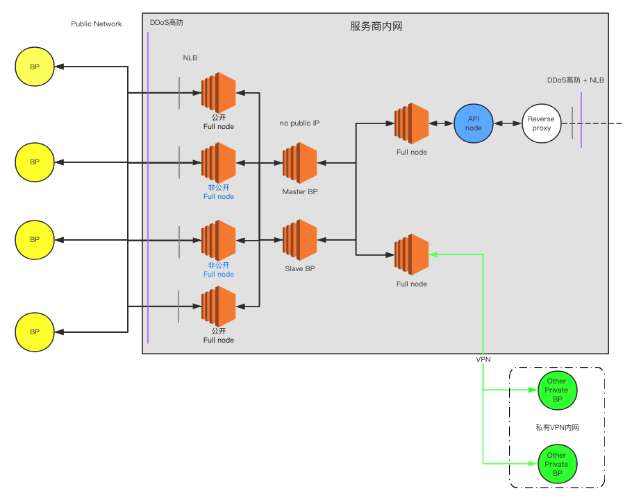
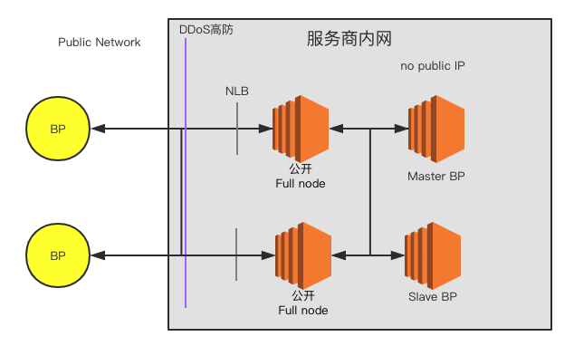
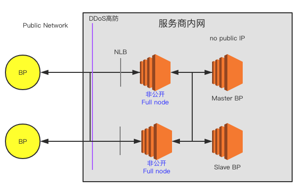
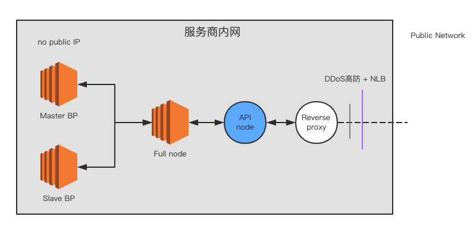
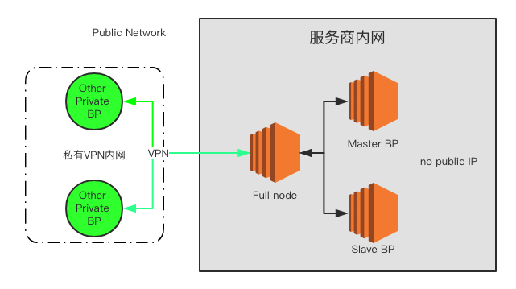

# EOS bp nodes security checklist（EOS超级节点安全执行指南）

> by 慢雾安全团队 & Joinsec Team
> 
> 感谢 MORE.TOP, EOSAsia, EOS.Store 倾力相助

## 架构核心目标

1. 保护出块服务器正常通信与运行
2. 增强初始主网整体抗攻击能力
3. 保护节点安全

## 面临的主要问题

1. 对初始状态主网进行 DDoS
2. RPC 功能滥用
3. 通信故障

## 架构核心设计

1. BP 服务器隔离
2. 多跳转节点（小节点流量转发，大节点高防护）
3. 多链路高可用

## 核心防御

1. 默认关闭 RPC。必须打开时，混淆端口，并架设高防等保护
2. BP 通信多链路设计

	- BP 服务器不在公网上暴露，通过跳板服务器（跳板服务器数量要大）进行通信；
	- 在外网公布的跳板服务器大面积瘫痪时，通过私有网络（1.私有秘密节点 2.私有VPN链路）来同步区块

3. 防止全网扫描定位高防后的服务器，修改同步端口 9876 （同理RPC的8888）至全网最大存活数量的端口 80、443 或 22，这样可以有效抬高攻击者定位成本。

## 推荐总架构



架构说明：

为了应对可能的 DDoS 攻击，节点应准备多条链路，在攻击到来后，可以随时通过备用链路进行通信，确保主网顺利启动，并持续出块。

首先，每个节点应至少准备 2 个公开 full node、2 个私密 full node，公开 full node 的 IP 可以对外公开，以供 Dapp 和主网正常通信。另 2 个私密 full node 的 IP 只告知被选中的其他超级节点，不对外公开，以避免同时遭遇 DDoS 攻击。

假如私密 full node 的 IP 也被攻击者获知（例如扫描全网所有 IPv4 地址）并遭遇 DDoS 攻击导致节点间无法正常通信，此时可通过 VPN 加密链路连接到虚拟内网，确保 21 个超级节点之间不间断的正常通信。

### 架构各部分设计说明

#### 1. 公开节点（对外公开在社区节点列表里）



在没有攻击情况下，外围节点通过对外公布的公开节点进行通信。

#### 2. 私密节点（只对其他可信BP节点私密分享的通信节点）



当攻击者通过公开的节点列表攻击公开节点造成公开节点不可用时，则可通过私密节点进行通信。（私密节点可被全网扫描发现，所以并不完全安全）

#### 3. VPN 加密节点（各可信节点间最后的秘密的通信信道）



当公网节点都被发现，并且攻击者进行攻击导致对公网 Full node 服务器全部阻塞，最后则由私有VPN网络在隔离的虚拟内网内进行通信，保证最基础的出块正常。

#### 4. RPC API 节点



查询用 RPC 所在 Full node 与 BP 完全隔离并架设防御，保证外网对 RPC 的攻击不能影响到 BP 。


## 加固安全方案

### 1. RPC 安全

#### 1.1 屏蔽 RPC

如无必要，建议禁止 RPC 对外访问，配置方法如下：

- 配置为空值`http-server-address =`
- 注释`https-server-address`

#### 1.2 开启 SSL

如果确实需要对外提供 RPC 服务，建议禁用 HTTP 协议，使用 HTTPS，配置方法如下：

- 注释`http-server-address`，或者配置为`127.0.0.1:8888`
- 配置`https-server-address`为`0.0.0.0:9999`
- 配置`https-certificate-chain-file` 和 `https-private-key-file` 为证书链文件路径和私钥文件路径，注意两个文件格式必须为 PEM

#### 1.3 禁用 `wallet_plugin` 和 `wallet_api_plugin`

在对外提供 RPC 服务的场景下，**一定不要加载**`wallet_plugin` 和 `wallet_api_plugin`。如果加载了`wallet_plugin `，攻击者就可以通过 RPC API `/v1/wallet/list_keys` 获取解锁账户的私钥。此外，攻击者还可以恶意循环调用`/v1/wallet/lock_all`使节点上的账户无法解锁。

#### 1.4 禁用`producer_api_plugin`

在对外提供 RPC 服务的场景下，**一定不要加载**`producer_api_plugin `。如果加载了`producer_api_plugin `，攻击者就可以通过 RPC API `/v1/producer/pause` 远程控制节点停止生产。

### 2. 配置安全

#### 2.1 生成 active 多签密钥

由于超级节点账户的公私钥明文配置在`config.ini`中，存在较大的风险，建议对这个账户生成 active 多签，提高资产转出门槛。举例如下：

```
授予 shrimp2 和 shrimp3 拥有 shrimp1 的权限

cleos set account permission shrimp1 active '{"threshold":1,"keys":[{"key":"EOS6tjMy84SYqQEUcUXQeMLmeBo99aakJCbieu2TSMk2Agn6nTwmX","weight":1}],"accounts":[{"permission":{"actor":"shrimp2","permission":"active"},"weight":1},{"permission":{"actor":"shrimp3","permission":"active"},"weight":1}],"waits":[]}' owner
```

#### 2.2 开启日志记录

在配置文件中配置`logconf`参数，记录必要的 RPC 请求日志。

#### 2.3 Docker 默认参数优化

官方仓库`https://github.com/EOSIO/eos/blob/master/Docker/config.ini`中的配置过于宽泛，加载了`wallet_api_plugin `等插件，存在较大风险，建议在`docker build`之前修改配置。

#### 2.4 `max-clients`参数优化

在配置文件中配置`max-clients = 0` 提升 P2P 端口并发连接数为无限制，同时优化`ulimit`等系统参数，增强恶意连接攻击承受能力。

### 3. 网络安全

#### 3.1 网络架构

为应对可能的 DDoS 攻击导致节点主网络阻塞的问题，建议提前配置备份网络，例如私密 VPN 网络。具体可参考 [EOS Asia](https://www.eosasia.one/) 的架构图：


#### 3.2 云服务商

经慢雾安全团队测试，Google Cloud Platform 和 Amazon Web Services 具有更好的抗DDoS攻击的性能，并且在DDoS攻击过后服务商不会临时封锁服务器，可以极为快速的恢复网络访问，推荐超级节点使用。（请谨慎选择云服务商，许多云服务商在遭遇 DDoS 等攻击时会直接关闭服务器）

#### 3.3 DDoS 防御

为应对可能发生的 DDoS 攻击，建议超级节点提前配置 Cloudflare、AWS Shield等 DDoS 高防服务。

### 4. 主机安全

- 防止全网扫描定位高防后的服务器，修改同步端口 9876 （同理RPC的8888）至全网最大存活数量的端口 80、443 或 22，这样可以有效抬高攻击者定位成本。
- 关闭不相关的其他服务端口，并在 AWS 或 Google cloud 上定制严格的安全规则。
- 更改 SSH 默认的 22 端口，配置 SSH 只允许用 key （并对key加密）登录，禁止密码登录，并限制访问SSH端口的IP只能为我方运维IP。
